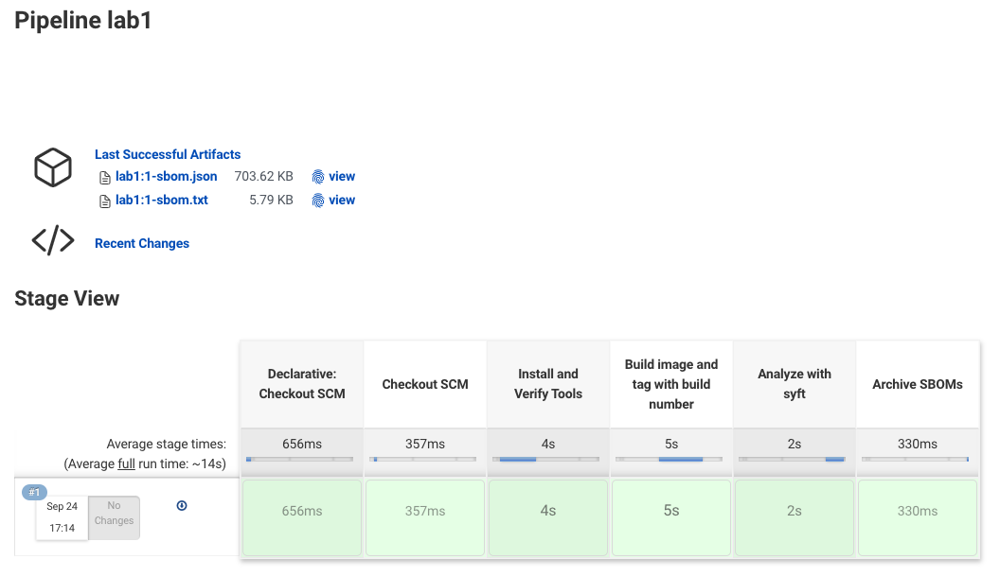

## Lab 1: Create SBOMs

The goal of this lab is to build on the previous lab and add a quick SBOM creation and archive to it.

The Dockerfile/Jenkinsfile in this directory are just for reference, and for recovery purposes if you make any mistakes during the lab.


1) Edit the Jenkinsfile.  There are three changes to make for this lab.

a) In the "Install and Verify Tools" stage, we want to run a check to see if our SBOM tools are available, and if not, install them.  Right after the `which docker` check, inside the `sh` script, let's add these additional commands:
```
          ### make sure syft is available, and if not, download and install 
          if [ ! $(which syft) ]; then
            curl -sSfL https://raw.githubusercontent.com/anchore/syft/main/install.sh | sh -s -- -b ${HOME}/.local/bin
          fi
          ### same for grype
          if [ ! $(which grype) ]; then
            curl -sSfL https://raw.githubusercontent.com/anchore/grype/main/install.sh | sh -s -- -b ${HOME}/.local/bin
          fi
          PATH=${HOME}/.local/bin:${PATH}
          # setting PATH here isn't really necessary since we're just going to exit this sh step anyway but it's
          # a good reminder that it needs to be done when we actually need syft and grype
          #
          # also, we can go ahead and sanity check that the tools were installed correctly:
          which syft
          which grype
```

b) After the "build image" stage, we'll want to add a new stage:

```
    stage('Analyze with syft') {
      steps {
        // run syft, output in both json and text formats
        //
        // note: setting PATH here like this will work regardless of whether syft/grype 
        // were installed before we ran this pipeline or during the pipeline execution
        sh '''
          # first, let's make sure there's no old sboms laying around (just so our build artifacts are clean)
          rm -f *sbom*
          # set the PATH just to be sure
          PATH=${HOME}/.local/bin:${PATH}
          # run syft and output both json and text files.
          syft --output json=${IMAGE}-sbom.json --output table=${IMAGE}-sbom.txt ${IMAGE} 
        '''
      } // end steps
    } // end stage "analyze with syft"
```

c) We also want to add a stage to archive the sboms so we can find them later:
```
    stage('Archive SBOMs') {
      steps {
        // archive anything with "sbom" in the name
        archiveArtifacts artifacts: '*sbom*'
        // and, just to be sure, let's clean up after ourselves, 
        // remove any sboms we've created from the workspace
        sh 'rm -f *sbom*'
      } // end steps
    } // end stage "Archive SBOMs"
```   

2) (optional) Edit the Dockerfile (in the root of the repository) and change the label from "lab0" to "lab1" (this really isn't that big of a deal)
3) From the Dashboard of your Jenkins instance, create a new item just like in Lab 0, only name it... "lab1".  Everything else should be the same.
4) When your build completes, you should see the SBOMs listed under "Last Successful Artifacts" (you may need to refresh the page after the build is successful to see this).  You can also drill down into any particular build to see the artifacts from that build.



