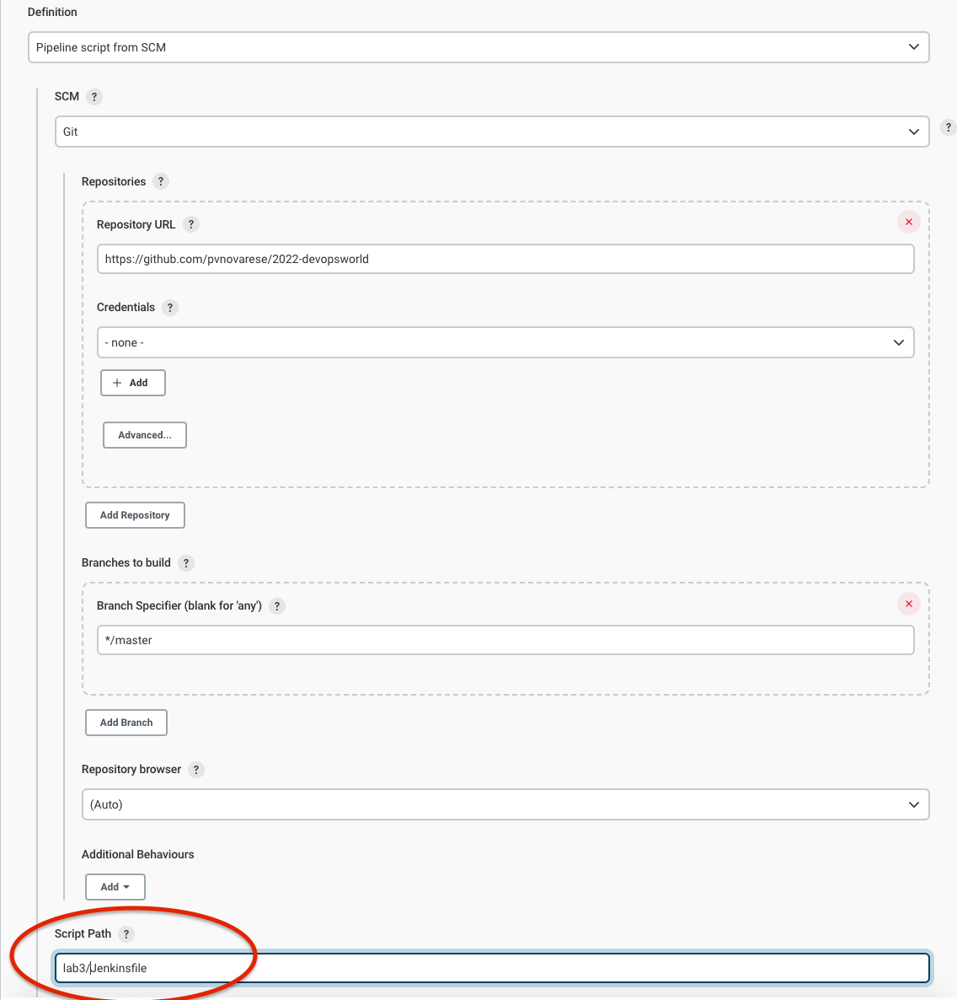
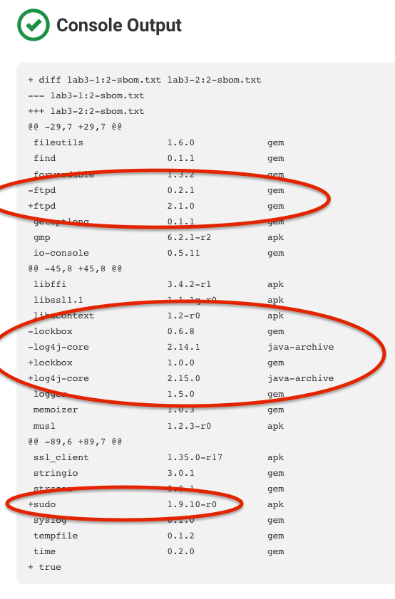

## Lab 3: Check for Drift

Goal: check for differences across builds

This is just a very quick demo, and we'll use the text SBOMs in this exercise for simplicity.  For real world usage, you would more likely want to use json SBOMs for better accuracy

To begin, setup for this lab will be a little different.  Instead of editing the main Jenkinsfile in the root of the repo, we'll just use the canned one here in this directory.  When you add a new project from the dashboard, specify the Script Path as `lab3/Jenkinsfile` as shown:

If you take a look at the Jenkinsfile, you'll see we are going to build two images and then just do a simple diff of their SBOMs.

If you then look at the two Dockerfiles, you'll see the only differences are that we're updating the version of log4j, removing the pinned dependencies for ftpd and lockbox, and added sudo.  The resulting diff output should look something like this:

